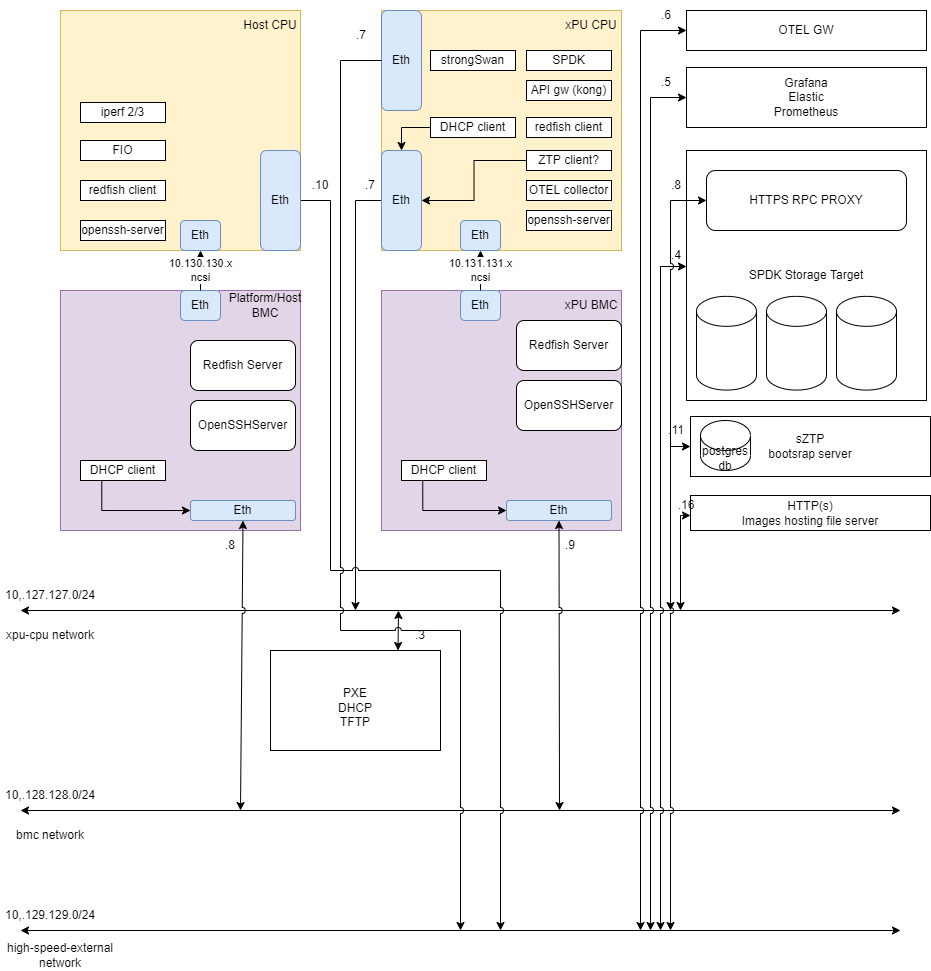

# Integration

## Diagram



## Prereqs

Install docker-compose <https://docs.docker.com/compose/install/>

Minimal supported version is:

```bash
 $ docker-compose -v
docker-compose version 1.29.2, build unknown
```

### Prereqs - Red Hat

docker-compose does work on Red Hat OSes starting with podman 3.x.
For example:

```bash
sudo dnf install -y podman podman-docker
sudo systemctl enable podman.socket --now
```

### Prereqs - PIP

One can install latest docker-compose via PIP

```bash
sudo python3 -m pip install --upgrade docker-compose
```

## Start

This pulls the latest images and only builds those it cannot find.

```bash
./scripts/integration.sh start
```

If you are making changes to the container images, you can `build` them before
running `start`.  **Note** This does not work for images pulled from a cr like
the spdk-target image.

```bash
./scripts/integration.sh build
./scripts/integration.sh start
```

If you try to run on a platform that does not support every extended instruction
that SPDK supports, the pulled spdk-target image will not function.  To work
around this, set the `BUILD_SPDK` variable before starting:

```bash
BUILD_SPDK=1 ./scripts/integration.sh start
```

### Start - Red Hat

**Note** Root-less podman is not supported.  So run the integration script as
root:

```bash
sudo ./scripts/integration.sh start
```

## Test

To manually check the run, execute the following:

<!-- markdownlint-disable -->
* Check Prometheus at <http://0.0.0.0:9091>
* Check Platform/Host BMC redfish server <http://0.0.0.0:8001/redfish/v1>
* Check NIC/DPU/IPU BMC redfish server <http://0.0.0.0:8002/redfish/v1>
* Check PXE server <http://0.0.0.0:8082/var/lib/tftpboot>
* Log into Host CPU: `ssh -o StrictHostKeyChecking=no -o UserKnownHostsFile=/dev/null -p 2210 host@127.0.0.1`
* Log into Host BMC: `ssh -o StrictHostKeyChecking=no -o UserKnownHostsFile=/dev/null -p 2208 bmc@127.0.0.1`
* Log into  xPU CPU: `ssh -o StrictHostKeyChecking=no -o UserKnownHostsFile=/dev/null -p 2207 xpu@127.0.0.1`
* Log into  xPU BMC: `ssh -o StrictHostKeyChecking=no -o UserKnownHostsFile=/dev/null -p 2209 bmc@127.0.0.1`
<!-- markdownlint-restore -->

You can also run the CI tests and log collection as follows:

```bash
./scripts/integration.sh tests
./scripts/integration.sh logs
```

## Stop

```bash
./scripts/integration.sh stop
```

### Stop - Red Hat

**Note** `stop` currently has an issue in this environment where you need to
run it twice to fully clean up.

```bash
sudo ./scripts/integration.sh stop
sudo ./scripts/integration.sh stop
```
